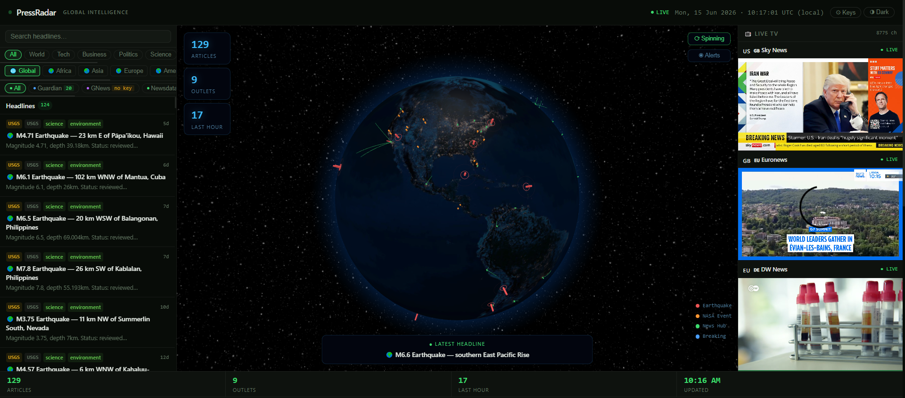
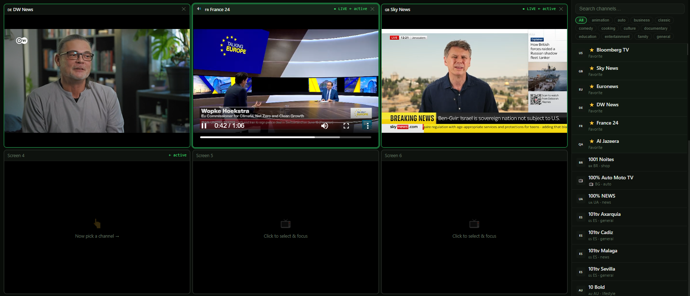

# 📡 Press Radar

**Real-time global news intelligence in a single HTML file.**

Live news feeds, a WebGL 3D globe with earthquake and natural event alerts, and a multi-stream live TV wall with 800+ channels — all in one file, no build step, no server, no npm.

[](https://github.com/NameRami/PressRadar/PressRadar.html)
[](LICENSE)
[]()




---

## 🔴 [→ Open Live Demo](https://github.com/NameRami/PressRadar/PressRadar.html)

> No install, no login. Opens directly in your browser.

---

## ✨ Features

### 📰 News Feed
- **8 simultaneous sources** aggregated and deduplicated in real time
- Filter by **9 topics** (World, Tech, Business, Politics, Science, Health, Sports, Culture, Environment)
- Filter by **continent** (Africa, Asia, Europe, Americas, Middle East, Oceania)
- Filter by **source** (Guardian, GNews, Newsdata, RSS, Hacker News, USGS, NASA)
- Live search across all headlines
- Auto-refreshes every 5 minutes

### 🌍 3D Intelligence Globe
- WebGL globe powered by [globe.gl](https://github.com/vasturiano/globe.gl) + Three.js
- **All 195 countries** rendered with borders from TopoJSON world-atlas
- **Earthquake alerts** — live USGS significant earthquake data, pinned to exact coordinates with magnitude-scaled dots and pulsing rings
- **NASA EONET events** — active natural events (wildfires, storms, floods, volcanic activity) pinned to location
- **65-city global arc network** — animated news flow arcs connecting broadcast hubs across every continent
- **Dark / Light globe themes** — night satellite imagery or daylight map
- Hover any country to see its name; click an alert dot to open the source article
- Drag to rotate, scroll to zoom, toggle auto-rotation

### 📺 Live TV Wall

> **Watch up to 6 live news streams simultaneously** — pick your layout, assign any channel to any slot, switch on the fly.

The TV Wall is a fully independent section below the main dashboard, designed for multi-source broadcast monitoring:

| Layout | Screens | Best for |
|--------|---------|----------|
| **2×1** | 2 streams side by side | Quick A/B comparison |
| **2×2** | 4 streams in a grid | Standard newsroom view |
| **2×3** | 6 streams in a grid | Full multi-source monitoring |

**How it works:**
1. Click a screen slot to make it active
2. Pick any channel from the right-side browser — it loads instantly
3. Switch layouts at any time without losing running streams
4. Close individual slots independently

**What's included:**
- **3 always-on pinned streams** auto-start at the top: Bloomberg TV 🇺🇸, Sky News 🇬🇧, Euronews 🇪🇺
- **6 favourite channels** always visible at the top of the picker: + DW 🇩🇪, France 24 🇫🇷, Al Jazeera 🇶🇦
- **800+ channels** from the [iptv-org](https://github.com/iptv-org/iptv) community playlist — filter by category (News, Sports, Entertainment…) or search by name
- **HLS streaming** via hls.js with automatic URL fallback if a stream goes offline
- **Per-slot status indicators** — `● LIVE`, `… loading`, `✕ offline`
- Global mute control

### 🎨 UI
- Dark / Light theme toggle — swaps both the interface and the globe texture, preference saved to localStorage
- Stats bar (article count, outlet count, last-hour activity)
- Live UTC clock
- BYOK (bring your own keys) modal for paid API tiers

---

## 🚀 Quick Start

```bash
git clone https://github.com/NameRami/press-radar.git
cd press-radar
open PressRadar.html   # macOS
# or just double-click PressRadar.html in your file manager
```

That's it. No `npm install`. No server. No `.env` file needed for basic use.

Or just use the **[live demo](https://github.com/NameRami/PressRadar/PressRadar.html)** — no cloning needed.

---

## 🔑 API Keys (Optional)

Press Radar works out of the box with zero configuration. Several sources have optional paid tiers that unlock more articles:

| Source | Free tier | Key location |
|--------|-----------|--------------|
| **The Guardian** | 5,000 req/day, full text | [open-platform.theguardian.com](https://open-platform.theguardian.com/) |
| **GNews** | 100 req/day | [gnews.io](https://gnews.io) |
| **Newsdata.io** | 200 req/day | [newsdata.io](https://newsdata.io) |
| **RSS via rss2json** | 60 req/hour (shared) | No key needed |
| **Hacker News** | Unlimited | No key needed |
| **USGS Earthquakes** | Unlimited | No key needed |
| **NASA EONET** | Unlimited | No key needed |

Click **⚙ Keys** in the top bar to enter your keys. They are stored in your browser's `localStorage` only — never sent anywhere except the respective API.

> **Note on RSS proxy:** The free rss2json.com tier rate-limits at 60 requests/hour across all users of the shared key. If feeds show errors, wait a minute or add your own rss2json key in the source.

---

## 🗂 Project Structure

```
press-radar/
├── PressRadar.html          # The entire application — HTML + CSS + JS
├── README.md
├── LICENSE
├── CONTRIBUTING.md
└── docs/
    └── screenshot.png
```

Everything lives in `PressRadar.html` by design. This makes it trivially forkable, hostable on GitHub Pages, and auditable — you can read the entire codebase in one file.

---

## 🌐 Self-Hosting

### GitHub Pages (recommended)
1. Fork this repo
2. Go to **Settings → Pages → Source → main branch / root**
3. Your dashboard is live at `https://NameRami.github.io/press-radar`

### Any static host
Drop `PressRadar.html` on Netlify, Vercel, Cloudflare Pages, or any web server. No configuration needed.

### Local
Just open the file. Most features work from `file://` — some browsers restrict certain fetch calls from local files, in which case serve it with any local server:

```bash
python3 -m http.server 8080
# then open http://localhost:8080
```

---

## 📡 Data Sources

| Layer | Source | Coverage |
|-------|--------|----------|
| Wire services | Reuters, AP, AFP | Global |
| Broadcasters | BBC, Al Jazeera, DW, France 24 | Global |
| Print | NYT, WSJ, CNBC, The Verge, Wired | US/Global |
| Aggregators | Google News, Hacker News | Global |
| Science | NASA News | Global |
| Defence | Defense News | Global |
| Earthquakes | USGS Significant Earthquakes | Global, real-time |
| Natural events | NASA EONET | Global, real-time |
| Live TV | iptv-org community playlist | 800+ channels, 100+ countries |
| Country borders | world-atlas TopoJSON (Natural Earth) | 195 countries |

---

## 🤝 Contributing

Contributions welcome. The most impactful areas:

- **TV streams** — channels go dead. PRs that fix or add working HLS stream URLs are always useful
- **RSS feeds** — add feeds from underrepresented regions (more African, South Asian, Latin American outlets)
- **Globe hub cities** — improve arc network coverage
- **Bug fixes** — especially around CORS errors and stream fallbacks

Please read [CONTRIBUTING.md](CONTRIBUTING.md) before opening a PR.

---

## 🛠 Tech Stack

| Layer | Technology |
|-------|-----------|
| Globe | [globe.gl](https://github.com/vasturiano/globe.gl) + Three.js |
| Country borders | [world-atlas](https://github.com/topojson/world-atlas) TopoJSON |
| HLS streaming | [hls.js](https://github.com/video-dev/hls.js/) |
| TV channel list | [iptv-org](https://github.com/iptv-org/iptv) |
| RSS proxy | [rss2json.com](https://rss2json.com) |
| Hosting | Any static host / GitHub Pages |

No frameworks. No bundler. No dependencies to install.

---

## ⚠️ Disclaimer

Press Radar aggregates publicly available RSS feeds and open APIs. It does not host, store, or redistribute any news content. Live TV streams are sourced from public community playlists — stream availability is not guaranteed and depends on third-party providers. This tool is intended for personal research and monitoring use.

---

## 📄 License

MIT — see [LICENSE](LICENSE)
